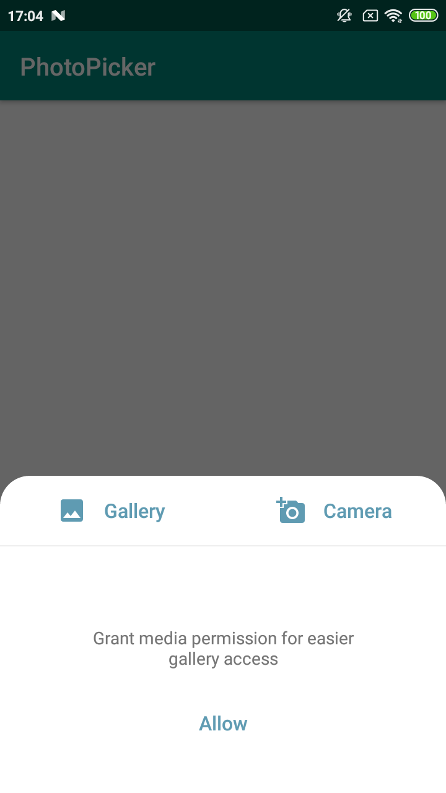
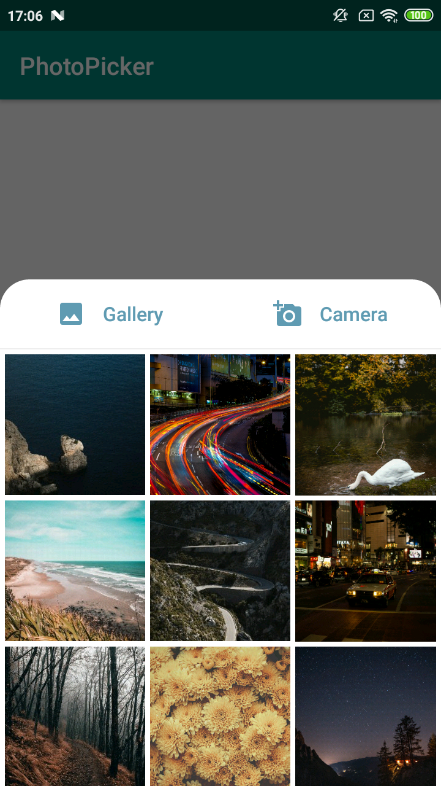
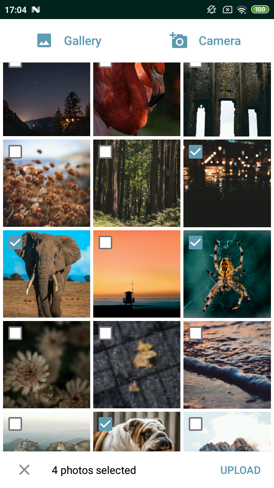

# ChiliPhotoPicker

Made with ❤️ by [Chili Labs](https://chililabs.io).

Library made without DataBinding, RxJava and image loading libraries, to give you opportunity to use it without additional dependencies.


- Picker styled as bottom sheet dialog
- Could be used for single or multiple photos pick
- Allows to choose how images are loaded into ImageView
- Takes responsibility for all needed permissions
- Takes responsibility for fetching gallery/camera result
- Have two built-in themes - Light and Dark
- Easy custamizable


| No permission                   | Single choice                      | Multiple choice                   |
|:-------------------------------:|:----------------------------------:|:---------------------------------:|
||       |    |

## Setup

Gradle:

Add Jitpack to your root `build.gradle` file:

```
allprojects {
    repositories {
        google()
        jcenter()
        maven { url "https://jitpack.io" }
    }
}
```

Add dependency to application `build.gradle` file, where `x.y.z` is the latest [release version](https://github.com/ChiliLabs/ChiliPhotoPicker/releases):

[](https://jitpack.io/#ChiliLabs/ChiliPhotoPicker)

```
implementation "com.github.ChiliLabs:ChiliPhotoPicker:x.y.z"
```

## Usage

Initialize `ChiliPhotoPicker` in your `Application`'s class `onCreate`
- `loader` - your preferred `ImageLoader` implementation (ready examples for Glide and Picasso are [here](https://github.com/ChiliLabs/ChiliPhotoPicker/tree/master/sample/src/main/java/lv/chi/chiliphotopicker/loaders))
- `authority` - your file provider authority. Is needed if you set `allowCamera` to `true`, so picker could store temporary photo from camera

``` kotlin
ChiliPhotoPicker.init(
        loader = GlideImageLoader(),
        authority = "lv.chi.sample.fileprovider"
    )
```

Create new instance of `PhotoPickerFragment`
- `multiple` - true for multiple image pick, false for single
- `allowCamera` - true to show Camera button, false to hide
- `maxSelection` - limit images count to pick
- `theme` - built-in or custom theme (by default `ChiliPhotoPicker.Light` is used)
- Show as dialog

``` kotlin
PhotoPickerFragment.newInstance(
        multiple = true, 
        allowCamera = true,
        maxSelection = 5,
        theme = R.style.ChiliPhotoPicker_Dark
).show(supportFragmentManager, YOUR_TAG)
```
Notes:
Picker will throw exception if:
- `loader` was not initialized
- `authority` was null while accessing camera

### ImageLoader

We don't want to depend on many image loading libraries, so we have simple `ImageLoader` interface, which you can implement using your preferred library (Glide, Picasso, Coil, etc.)
We have two working examples of `ImageLoader` implementations - using [Glide](https://github.com/ChiliLabs/ChiliPhotoPicker/blob/master/sample/src/main/java/lv/chi/chiliphotopicker/loaders/GlideImageLoader.kt) and [Picasso](https://github.com/ChiliLabs/ChiliPhotoPicker/blob/master/sample/src/main/java/lv/chi/chiliphotopicker/loaders/PicassoImageLoader.kt). You can just copy one of them or write your own implementation

### Callback

Picked photos URIs are returned via callbacks `onImagesPicked` function, so you just need to implement `PhotoPickerFragment.Callback` interface in your activity or fragment

### Themes

To customize picker you can use one of [built-in themes](https://github.com/ChiliLabs/ChiliPhotoPicker/blob/master/photopicker/src/main/res/values/themes.xml) or inherit it rewriting [attributes](https://github.com/ChiliLabs/ChiliPhotoPicker/blob/master/photopicker/src/main/res/values/attrs.xml) you want (see [example](https://github.com/ChiliLabs/ChiliPhotoPicker/blob/master/sample/src/main/res/values/styles.xml))

Attributes:
- `pickerBackgroundColor` - background color
- `pickerPrimaryColor` - primary picker color (no permission/empty texts, cancel icon)
- `pickerSecondaryColor` - secondary picker color (snackbar)
- `pickerControlColor` - color of buttons, icons, checkboxes, ripple
- `pickerGalleryIcon` - drawable for Gallery icon (to remove it use `@null` as attribute value)
- `pickerCameraIcon` - drawable for Camera icon (to remove it use `@null` as attribute value)
- `pickerCornerRadius` - background's corners radius
- `pickerDividerColor` - color of line below Gallery/Camera buttons

### Localization

It's difficult to translate library to each language, so default strings are on English, but you can easily override them. Example for common strings and plurals are [here](https://github.com/ChiliLabs/ChiliPhotoPicker/blob/master/sample/src/main/res/values/strings.xml). All strings used in library can be found [here](https://github.com/ChiliLabs/ChiliPhotoPicker/blob/master/photopicker/src/main/res/values/strings.xml)

## License

```
Copyright 2019 Chili Labs

Licensed under the Apache License, Version 2.0 (the "License");
you may not use this file except in compliance with the License.
You may obtain a copy of the License at

   http://www.apache.org/licenses/LICENSE-2.0

Unless required by applicable law or agreed to in writing, software
distributed under the License is distributed on an "AS IS" BASIS,
WITHOUT WARRANTIES OR CONDITIONS OF ANY KIND, either express or implied.
See the License for the specific language governing permissions and
limitations under the License.
```
